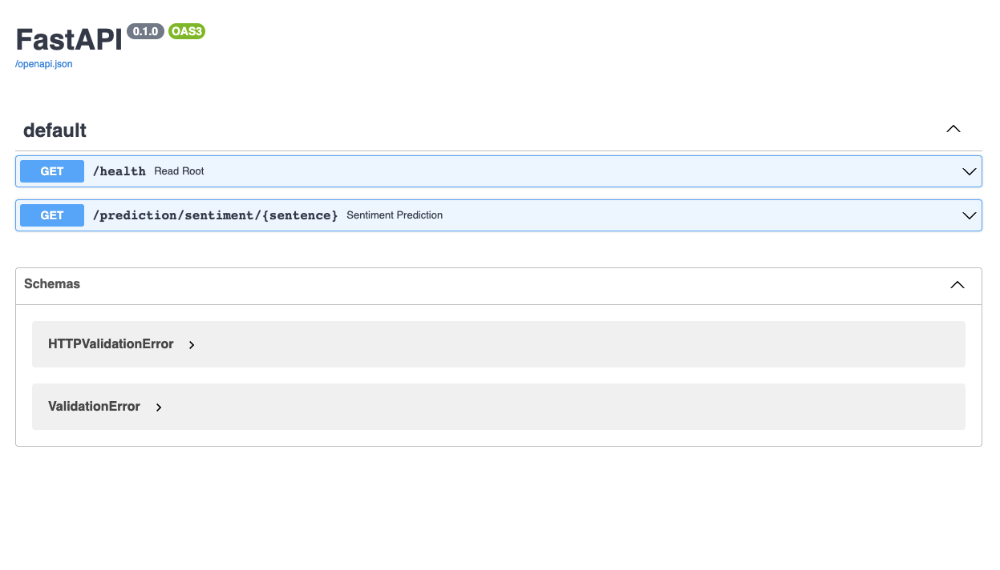
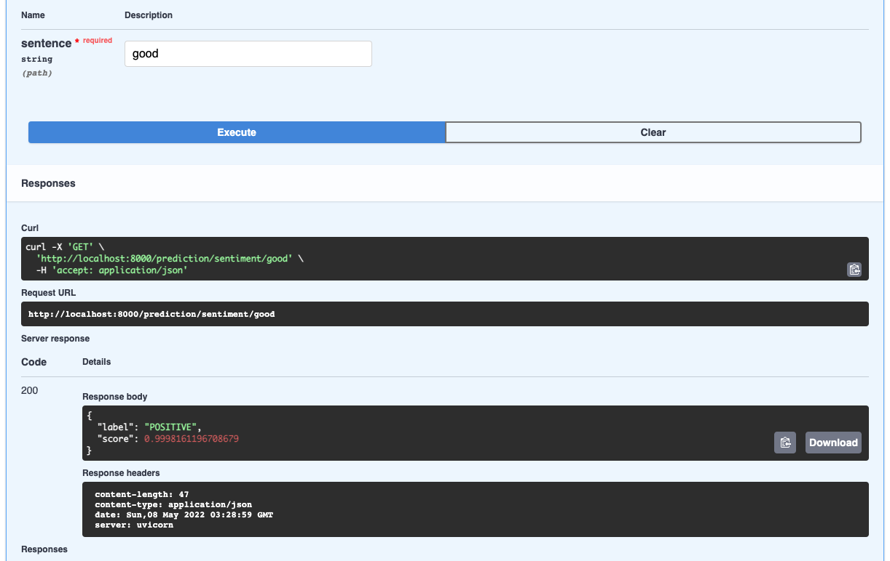

# MLFastAPI
Project template for learning how to deploy ML models using FastApi

Clone the repo, go to the directory `MLFastAPI` using your console and write
```Bash
docker-compose up
```

then go your browser and write

`http://0.0.0.0:8000/docs`

you should see this tab:



Try out /prediction/sentiment endpoint by passing a string sentence in english

